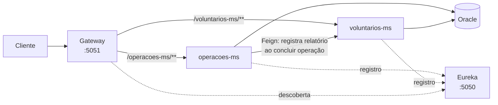
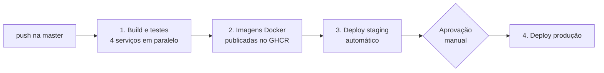

# Ocean Cleaner

API em microsserviços para organizar **operações de limpeza de áreas marítimas**: cadastro de áreas poluídas, planejamento de operações, gestão de voluntários e registro dos resíduos coletados.

> 📘 **Documentação técnica para desenvolvedores** (classes, serviços, regras de negócio e como evoluir o projeto): [docs/DOCUMENTACAO.md](docs/DOCUMENTACAO.md)

O projeto conta com um pipeline de **CI/CD no GitHub Actions** que compila, testa, gera imagens Docker e faz o deploy automático em **staging** e, após aprovação manual, em **produção**.

---

## Sumário
- [Arquitetura](#arquitetura)
- [Tecnologias](#tecnologias)
- [Executando localmente](#executando-localmente)
- [Endpoints da API](#endpoints-da-api)
- [Pipeline de CI/CD](#pipeline-de-cicd)
- [Ambientes (staging e produção)](#ambientes-staging-e-produção)
- [Configurando o pipeline em um novo repositório](#configurando-o-pipeline-em-um-novo-repositório)
- [Testes](#testes)
- [Evidências](#evidências)

---

## Arquitetura



| Serviço | Função | Porta (local) |
|---|---|---|
| `eureka-sd` | Service discovery (Netflix Eureka) | 5050 |
| `gateway` | Ponto de entrada único; roteia por nome de serviço com load balancing | 5051 |
| `operacoes-ms` | Áreas marítimas e operações de limpeza | aleatória (via Eureka) |
| `voluntarios-ms` | Voluntários e relatórios de coleta | aleatória (via Eureka) |
| `oracle-db` | Banco Oracle 23 Free (container) | 1521 |

**Integração entre serviços:** quando uma operação é atualizada com status `CONCLUIDA`, o `operacoes-ms` chama o `voluntarios-ms` via **OpenFeign** para registrar automaticamente o relatório de coleta.

**Banco de dados:** cada microsserviço versiona suas próprias tabelas com **Flyway** (históricos separados).

---

## Tecnologias

- Java 21 · Spring Boot 4 · Spring Cloud 2025.1 (Gateway, Eureka, OpenFeign)
- Spring Data JPA · Flyway · Oracle Database 23 Free
- Spring Security (HTTP Basic)
- JUnit 5 · Mockito
- Docker · Docker Compose (build multi-stage, usuário sem root)
- GitHub Actions · GitHub Container Registry (GHCR) · self-hosted runner

---

## Executando localmente

**Pré-requisitos:** Docker com Docker Compose.

```bash
cp .env.example .env      # preencha as senhas
docker compose up -d --build
```

O primeiro start leva alguns minutos (inicialização do Oracle). Depois:

- Gateway: http://localhost:5051
- Painel do Eureka: http://localhost:5050
- Ambiente em execução: http://localhost:5051/actuator/info

Para parar: `docker compose down` (acrescente `-v` para apagar também os dados do banco).

### Variáveis de ambiente (`.env`)

| Variável | Descrição |
|---|---|
| `ORACLE_PASSWORD` | Senha do administrador do Oracle |
| `DB_USERNAME` / `DB_PASSWORD` | Usuário da aplicação (criado automaticamente no banco) |
| `DB_URL` | JDBC do banco (padrão: container local `oracle-db`) |
| `API_USER` / `API_PASSWORD` | Credenciais HTTP Basic exigidas em POST/PUT/DELETE |

O `.env` está no `.gitignore` e nunca deve ser versionado.

---

## Endpoints da API

Todas as chamadas passam pelo Gateway, prefixadas pelo nome do serviço.
**GET é público**; **POST, PUT e DELETE exigem autenticação HTTP Basic** (`API_USER` / `API_PASSWORD`).

### operacoes-ms — `/operacoes-ms`

| Método | Rota | Descrição |
|---|---|---|
| POST | `/areas-maritimas` | Cadastra área marítima |
| GET | `/areas-maritimas` | Lista áreas |
| GET | `/areas-maritimas/{id}` | Busca área por id |
| DELETE | `/areas-maritimas/{id}` | Remove área |
| POST | `/operacoes` | Cadastra operação |
| GET | `/operacoes` | Lista operações |
| GET | `/operacoes/{id}` | Busca operação por id |
| GET | `/operacoes/status/{status}` | Lista operações por status |
| PUT | `/operacoes/{id}` | Atualiza operação (status `CONCLUIDA` gera relatório no voluntarios-ms) |
| DELETE | `/operacoes/{id}` | Remove operação |

### voluntarios-ms — `/voluntarios-ms`

| Método | Rota | Descrição |
|---|---|---|
| POST | `/voluntarios` | Cadastra voluntário |
| GET | `/voluntarios` | Lista voluntários |
| GET | `/voluntarios/{id}` | Busca voluntário por id |
| PUT | `/voluntarios/{id}` | Atualiza voluntário |
| DELETE | `/voluntarios/{id}` | Remove voluntário |
| POST | `/relatorios` | Cadastra relatório de coleta |
| GET | `/relatorios` | Lista relatórios |
| GET | `/relatorios/{id}` | Busca relatório por id |
| GET | `/relatorios/operacao/{idOperacao}` | Relatórios de uma operação |
| GET | `/relatorios/voluntario/{idVoluntario}` | Relatórios de um voluntário |
| DELETE | `/relatorios/{id}` | Remove relatório |

### Exemplo de fluxo completo

```bash
GW=http://localhost:5051
AUTH="admin:SUA_SENHA"

# 1. Área marítima
curl -u $AUTH -X POST $GW/operacoes-ms/areas-maritimas -H "Content-Type: application/json" \
  -d '{"nome":"Praia do Gonzaga","localizacao":"Santos - SP","nivelPoluicao":"ALTO"}'

# 2. Voluntário
curl -u $AUTH -X POST $GW/voluntarios-ms/voluntarios -H "Content-Type: application/json" \
  -d '{"nome":"Ana Souza","email":"ana@email.com","especialidade":"Mergulho"}'

# 3. Operação planejada
curl -u $AUTH -X POST $GW/operacoes-ms/operacoes -H "Content-Type: application/json" \
  -d '{"titulo":"Mutirão Gonzaga","dataOperacao":"2026-10-10","status":"PLANEJADA","idArea":1}'

# 4. Conclusão da operação -> gera o relatório no voluntarios-ms via Feign
curl -u $AUTH -X PUT $GW/operacoes-ms/operacoes/1 -H "Content-Type: application/json" \
  -d '{"titulo":"Mutirão Gonzaga","dataOperacao":"2026-10-10","status":"CONCLUIDA","idArea":1,
       "idVoluntario":1,"quantidadeResiduos":120,"tipoResiduo":"Plástico"}'

# 5. Relatório criado automaticamente
curl $GW/voluntarios-ms/relatorios/operacao/1
```

---

## Pipeline de CI/CD

Arquivos: [`.github/workflows/ci-cd.yml`](.github/workflows/ci-cd.yml) e [`.github/workflows/deploy.yml`](.github/workflows/deploy.yml).



| Etapa | Onde roda | O que faz |
|---|---|---|
| **1. Build e testes** | Runner do GitHub (`ubuntu-latest`) | `mvn verify` em cada microsserviço (matrix). Publica relatórios de teste e resumo na execução. |
| **2. Imagens Docker** | Runner do GitHub | Build multi-stage e push para o GHCR com as tags `<sha do commit>` e `latest`. |
| **3. Deploy staging** | Self-hosted runner | Gera o `.env` a partir dos secrets, baixa as imagens da versão e sobe o ambiente. Só conclui se o teste de fumaça passar. |
| **4. Deploy produção** | Self-hosted runner | Mesmo processo, **somente após aprovação** no environment `production`. |

Em **pull requests** roda apenas a etapa 1, garantindo que nada é mesclado sem compilar e passar nos testes.

**Teste de fumaça:** o [`deploy/deploy.sh`](deploy/deploy.sh) só considera o deploy bem-sucedido quando os dois microsserviços respondem `200` através do Gateway; caso contrário exibe os logs e falha o job.

**Rastreabilidade:** as imagens são identificadas pelo SHA do commit, e o endpoint `/actuator/info` de cada ambiente informa qual versão está no ar.

---

## Ambientes (staging e produção)

Os dois ambientes rodam na mesma máquina (self-hosted runner), isolados por **projetos Docker Compose diferentes**: cada um tem seus próprios containers, rede, volume de banco e credenciais.

| | Staging | Produção |
|---|---|---|
| Gateway | http://localhost:8081 | http://localhost:8080 |
| Eureka | http://localhost:8762 | http://localhost:8761 |
| Projeto Compose | `oceancleaner-staging` | `oceancleaner-production` |
| Deploy | automático a cada push na `master` | após aprovação manual |
| Credenciais | secrets do environment `staging` | secrets do environment `production` |

Diferenças para o ambiente local ([`deploy/docker-compose.deploy.yml`](deploy/docker-compose.deploy.yml)):
- as imagens **não são compiladas** na máquina: são baixadas do GHCR, exatamente as que passaram nos testes;
- `restart: unless-stopped` em todos os serviços;
- memória das JVMs limitada para os dois ambientes caberem na mesma máquina.

Para derrubar um ambiente manualmente:

```bash
cd ~/oceancleaner-deploy/staging
docker compose -p oceancleaner-staging -f docker-compose.deploy.yml down
```

---

## Configurando o pipeline em um novo repositório

1. **Self-hosted runner** — *Settings → Actions → Runners → New self-hosted runner* (Linux x64). Instale em um caminho **sem espaços** (ex.: `~/actions-runner`) e inicie com `./run.sh`. A máquina precisa de Docker e de ~10 GB livres em disco.
2. **Environments** — em *Settings → Environments*, crie:
   - `staging`
   - `production`, com **Required reviewers** marcado
3. **Secrets** — em cada environment, crie `ORACLE_PASSWORD`, `DB_PASSWORD` e `API_PASSWORD` (senhas diferentes por ambiente; use apenas letras e números).
4. Faça push na `master` e acompanhe na aba **Actions**.

> **Segurança:** com self-hosted runner em repositório público, ative *Settings → Actions → General → Require approval for all external contributors*, para que pull requests de terceiros não executem código na máquina do runner.

---

## Testes

```bash
cd operacoes-ms && ./mvnw verify
```

| Serviço | Testes |
|---|---|
| `operacoes-ms` | `AreaMaritimaServiceTest`, `OperacaoServiceTest` (inclui a chamada Feign ao concluir operação), teste de contexto |
| `voluntarios-ms` | `VoluntarioServiceTest`, teste de contexto |
| `gateway`, `eureka-sd` | Teste de contexto |

Os testes unitários usam Mockito e não dependem de banco nem de outros serviços. Nos microsserviços, os testes de contexto usam um banco H2 em memória (`src/test/resources/application-test.properties`) no lugar do Oracle.

---

## Evidências

<!-- Adicione os prints na pasta docs/prints/ com estes nomes -->

**Execução completa do pipeline**


**Aprovação manual para produção**


**Ambientes no ar (`/actuator/info`)**


**Serviços registrados no Eureka**


**Histórico de deploys por ambiente**

