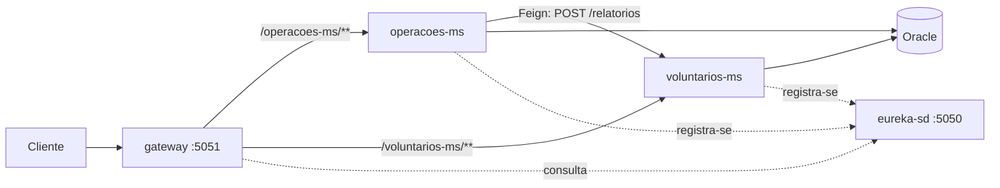
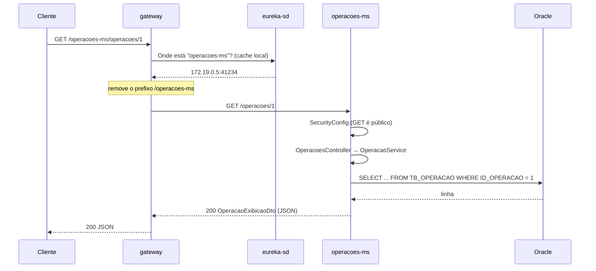
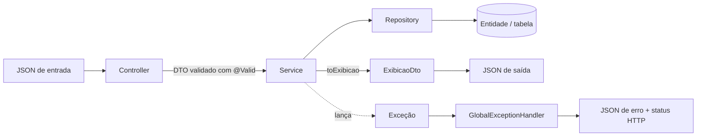
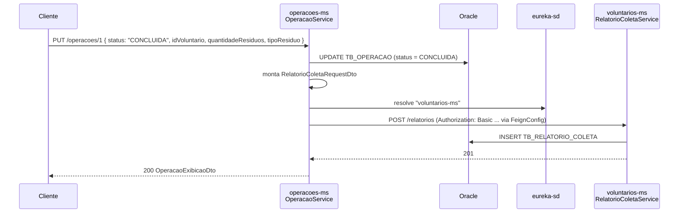
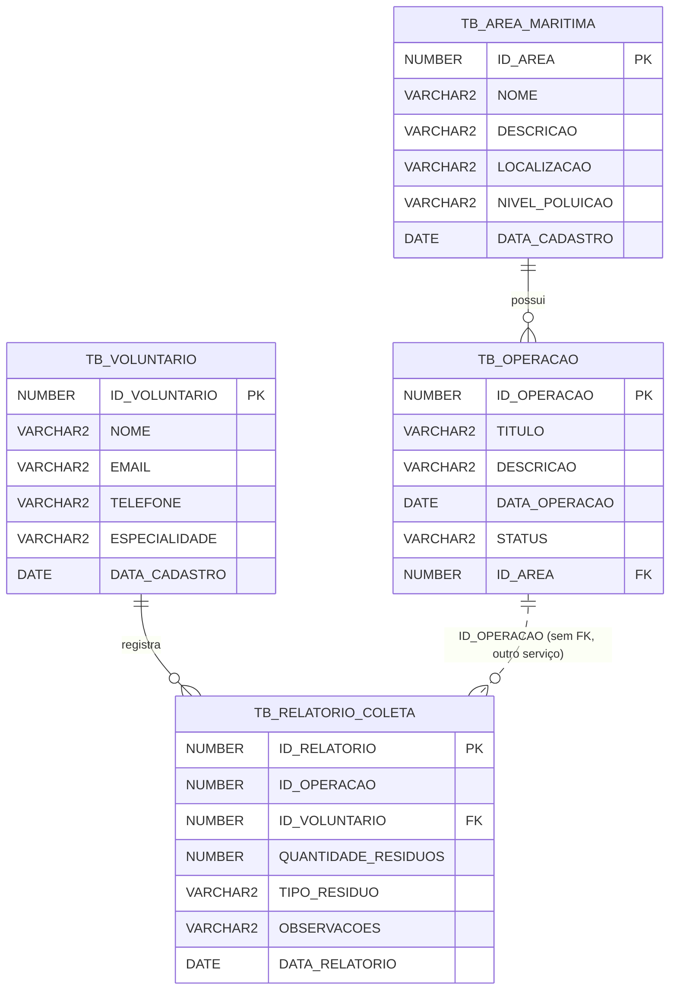

# Documentação técnica — Ocean Cleaner

Guia para desenvolvedores entenderem **como o projeto funciona por dentro**: serviços, camadas, classes, regras de negócio, comunicação entre microsserviços e onde mexer para evoluir o sistema.

> Para rodar o projeto, endpoints resumidos e o pipeline de CI/CD, veja o [README](../README.md).

---

## Sumário

1. [Visão geral](#1-visão-geral)
2. [Estrutura do repositório](#2-estrutura-do-repositório)
3. [Como uma requisição percorre o sistema](#3-como-uma-requisição-percorre-o-sistema)
4. [Padrão de camadas dos microsserviços](#4-padrão-de-camadas-dos-microsserviços)
5. [eureka-sd](#5-eureka-sd--service-discovery)
6. [gateway](#6-gateway--ponto-de-entrada)
7. [operacoes-ms](#7-operacoes-ms)
8. [voluntarios-ms](#8-voluntarios-ms)
9. [Comunicação entre serviços (Feign)](#9-comunicação-entre-serviços-feign)
10. [Modelo de dados](#10-modelo-de-dados)
11. [Segurança](#11-segurança)
12. [Tratamento de erros](#12-tratamento-de-erros)
13. [Configuração](#13-configuração)
14. [Testes](#14-testes)
15. [Guia: como evoluir o projeto](#15-guia-como-evoluir-o-projeto)
16. [Pontos de atenção conhecidos](#16-pontos-de-atenção-conhecidos)

---

## 1. Visão geral

O Ocean Cleaner gerencia **operações de limpeza de áreas marítimas**. O domínio está dividido em dois microsserviços de negócio, apoiados por dois serviços de infraestrutura:

| Serviço | Tipo | Responsabilidade | Porta |
|---|---|---|---|
| `eureka-sd` | Infraestrutura | Registro e descoberta de serviços (Netflix Eureka Server) | 5050 |
| `gateway` | Infraestrutura | Ponto de entrada único; encaminha as requisições para o serviço correto | 5051 |
| `operacoes-ms` | Negócio | **Áreas marítimas** e **operações de limpeza** | aleatória |
| `voluntarios-ms` | Negócio | **Voluntários** e **relatórios de coleta** | aleatória |
| `oracle-db` | Banco | Oracle 23 Free, compartilhado pelos dois microsserviços | 1521 |



**Ideia central do domínio:** uma *área marítima* recebe *operações* de limpeza. Quando uma operação é marcada como `CONCLUIDA`, o `operacoes-ms` avisa o `voluntarios-ms`, que registra um *relatório de coleta* ligado ao *voluntário* que participou.

---

## 2. Estrutura do repositório

```
Ocean Cleaner/
├── eureka-sd/                 # Service discovery
├── gateway/                   # API Gateway
├── operacoes-ms/              # Microsserviço de áreas e operações
├── voluntarios-ms/            # Microsserviço de voluntários e relatórios
├── deploy/                    # Compose e script usados no deploy (staging/produção)
├── docs/                      # Esta documentação e prints de evidência
├── .github/workflows/         # Pipeline de CI/CD
├── docker-compose.yaml        # Ambiente local completo
└── .env.example               # Modelo das variáveis de ambiente
```

Cada serviço é um **projeto Maven independente** (tem seu próprio `pom.xml`, `mvnw` e `Dockerfile`). Não existe um `pom.xml` agregador: compile e teste cada serviço dentro da sua pasta.

Estrutura interna de um microsserviço de negócio (exemplo: `operacoes-ms`):

```
operacoes-ms/src/main/java/br/com/fiap/operacoes_ms/
├── OperacoesMsApplication.java   # Classe principal (@SpringBootApplication)
├── SecurityConfig.java           # Regras de autenticação
├── FeignConfig.java              # Autenticação das chamadas Feign
├── controller/                   # Endpoints REST
├── service/                      # Regras de negócio
├── repository/                   # Acesso ao banco (Spring Data JPA)
├── model/                        # Entidades JPA (tabelas)
├── dto/                          # Objetos de entrada e saída da API
├── http/                         # Clientes Feign para outros serviços
└── exception/                    # Exceções e tratamento global de erros
src/main/resources/
├── application.properties
└── db/migration/                 # Scripts Flyway
```

---

## 3. Como uma requisição percorre o sistema

Exemplo: `GET http://localhost:5051/operacoes-ms/operacoes/1`



Pontos importantes:

1. **Os microsserviços não têm porta fixa** (`server.port=0`). Ao subir, cada instância se registra no Eureka com o IP e a porta sorteada.
2. **O Gateway resolve o destino pelo nome** (`lb("operacoes-ms")`), consultando o Eureka. Se houver várias instâncias, ele distribui a carga entre elas.
3. **O primeiro segmento do caminho é removido** (`stripPrefix(1)`): `/operacoes-ms/operacoes/1` chega ao serviço como `/operacoes/1`.
4. Logo após subir, um serviço pode levar alguns segundos para aparecer no Eureka. Nesse intervalo o Gateway responde erro para aquela rota.

---

## 4. Padrão de camadas dos microsserviços

Os dois microsserviços de negócio seguem exatamente o mesmo padrão:



| Camada | Papel | Convenções do projeto |
|---|---|---|
| **Controller** | Recebe HTTP, valida a entrada, devolve status | Não contém regra de negócio. `POST` → 201, `DELETE` → 204, demais → 200 |
| **DTO de entrada** (`XxxDto`) | Dados que o cliente envia | Validado com Bean Validation (`@NotBlank`, `@NotNull`, `@Email`) |
| **DTO de saída** (`XxxExibicaoDto`) | Dados que a API devolve | Nunca expõe a entidade diretamente |
| **Service** | Regras de negócio e conversão entre DTO e entidade | Conversão com `BeanUtils.copyProperties` + método privado `toExibicao` |
| **Repository** | Acesso a dados | Interface que estende `JpaRepository`; consultas derivadas do nome do método |
| **Model** | Entidade JPA mapeada para a tabela | Lombok `@Data`; nomes de colunas explícitos em `@Column` |
| **Exception** | Erros de negócio e resposta padronizada | `RecursoNaoEncontradoException` → 404; `IllegalStateException` → 409 |

As dependências são injetadas com `@Autowired` em atributos.

---

## 5. eureka-sd — service discovery

| Classe | Descrição |
|---|---|
| `EurekaSdApplication` | Classe principal. `@EnableEurekaServer` transforma a aplicação em servidor de registro. |

- Porta **5050**. O painel web mostra as instâncias registradas: http://localhost:5050
- Não se registra em si mesmo (`register-with-eureka=false`, `fetch-registry=false`).
- Expõe `/actuator/health`, usado pelo healthcheck do Docker Compose: Gateway e microsserviços só sobem depois que o Eureka está saudável.
- O pacote é `br.com.oceanclener.eureka_sd`, diferente dos demais (`br.com.fiap...`).

---

## 6. gateway — ponto de entrada

Implementado com **Spring Cloud Gateway Server WebMVC** (modelo servlet, não reativo).

| Classe | Descrição |
|---|---|
| `GatewayApplication` | Classe principal. `@EnableDiscoveryClient` permite resolver serviços pelo Eureka. |
| `GatewayConfig` | Define as rotas como beans `RouterFunction`. |

Rotas definidas em `GatewayConfig`:

| Bean | Caminho de entrada | Destino | Filtros |
|---|---|---|---|
| `operacoesRoute()` | `/operacoes-ms/**` | `lb("operacoes-ms")` | `stripPrefix(1)` |
| `voluntariosRoute()` | `/voluntarios-ms/**` | `lb("voluntarios-ms")` | `stripPrefix(1)` |

- `lb(...)`: *load balancer*, resolve o nome do serviço no Eureka.
- `stripPrefix(1)`: remove o primeiro segmento do caminho antes de encaminhar.

O Gateway **não aplica autenticação**: ele repassa os cabeçalhos (inclusive `Authorization`) e cada microsserviço valida por conta própria.

Em `application.properties`, o Gateway expõe todos os endpoints do Actuator. O `/actuator/info` mostra o ambiente (`APP_ENV`) e a versão (`APP_VERSION`, o SHA do commit no deploy), o que facilita saber o que está rodando em staging e produção.

---

## 7. operacoes-ms

Gerencia **áreas marítimas** e as **operações de limpeza** realizadas nelas. É o único serviço que chama outro serviço (via Feign).

### 7.1 Classes de configuração

| Classe | Descrição |
|---|---|
| `OperacoesMsApplication` | Classe principal. `@EnableDiscoveryClient` (registro no Eureka) e `@EnableFeignClients` (ativa os clientes Feign do pacote `http`). |
| `SecurityConfig` | Autenticação HTTP Basic com um único usuário em memória. Detalhes na [seção 11](#11-segurança). |
| `FeignConfig` | Registra um `BasicAuthRequestInterceptor` que adiciona o cabeçalho `Authorization` em toda chamada Feign, com as mesmas credenciais `API_USER`/`API_PASSWORD`. Sem isso, o `voluntarios-ms` recusaria o `POST /relatorios` com 401. |

### 7.2 Entidades (`model`)

**`AreaMaritima`** → tabela `TB_AREA_MARITIMA`

| Atributo | Coluna | Tipo | Obrigatório | Observação |
|---|---|---|---|---|
| `id` | `ID_AREA` | Long | — | Gerado pelo banco (identity) |
| `nome` | `NOME` | String(100) | sim | |
| `descricao` | `DESCRICAO` | String(255) | não | |
| `localizacao` | `LOCALIZACAO` | String(255) | sim | Texto livre |
| `nivelPoluicao` | `NIVEL_POLUICAO` | String(50) | sim | Texto livre (ex.: `BAIXO`, `ALTO`) |
| `dataCadastro` | `DATA_CADASTRO` | LocalDate | — | Preenchida pelo service com a data atual |

**`Operacao`** → tabela `TB_OPERACAO`

| Atributo | Coluna | Tipo | Obrigatório | Observação |
|---|---|---|---|---|
| `id` | `ID_OPERACAO` | Long | — | Gerado pelo banco |
| `titulo` | `TITULO` | String(100) | sim | |
| `descricao` | `DESCRICAO` | String(255) | não | |
| `dataOperacao` | `DATA_OPERACAO` | LocalDate | sim | Formato JSON `yyyy-MM-dd` |
| `status` | `STATUS` | String(50) | sim | Texto livre; `CONCLUIDA` tem efeito especial |
| `area` | `ID_AREA` (FK) | AreaMaritima | sim | `@ManyToOne` |

### 7.3 DTOs (`dto`)

| Classe | Uso | Campos |
|---|---|---|
| `AreaMaritimaDto` | Entrada (POST) | `nome`\*, `descricao`, `localizacao`\*, `nivelPoluicao`\* |
| `AreaMaritimaExibicaoDto` | Saída | `id`, `nome`, `descricao`, `localizacao`, `nivelPoluicao`, `dataCadastro` |
| `OperacaoDto` | Entrada (POST/PUT) | `titulo`\*, `descricao`, `dataOperacao`\*, `status`\*, `idArea`\*, e os campos usados na conclusão: `idVoluntario`, `quantidadeResiduos`, `tipoResiduo`, `observacoes` |
| `OperacaoExibicaoDto` | Saída | `id`, `titulo`, `descricao`, `dataOperacao`, `status`, `idArea`, `nomeArea` |
| `RelatorioColetaRequestDto` | Corpo da chamada Feign para o `voluntarios-ms` | `idOperacao`, `idVoluntario`, `quantidadeResiduos`, `tipoResiduo`, `observacoes` |

\* campo obrigatório (validado com `@NotBlank`/`@NotNull`).

Os campos `idVoluntario`, `quantidadeResiduos`, `tipoResiduo` e `observacoes` do `OperacaoDto` **não são gravados na tabela de operações**. Eles só servem para montar o relatório enviado ao `voluntarios-ms` quando a operação é concluída.

### 7.4 Repositórios (`repository`)

| Interface | Métodos além do CRUD do `JpaRepository` |
|---|---|
| `AreaMaritimaRepository` | — |
| `OperacaoRepository` | `findByAreaId(Long idArea)`: operações de uma área (usado para bloquear exclusão)<br>`findByStatus(String status)`: filtro por status (comparação exata) |

### 7.5 Services e regras de negócio

**`AreaMaritimaService`**

| Método | O que faz | Erros |
|---|---|---|
| `cadastrar(dto)` | Copia o DTO para a entidade, define `dataCadastro = hoje` e salva | — |
| `listar()` | Retorna todas as áreas | — |
| `buscarPorId(id)` | Retorna uma área | 404 se não existir |
| `deletar(id)` | Exclui a área **somente se não houver operações vinculadas** | 404 se não existir; **409** se houver operações |

**`OperacaoService`**

| Método | O que faz | Erros |
|---|---|---|
| `cadastrar(dto)` | Busca a área por `idArea`, vincula e salva a operação | 404 se a área não existir |
| `listar()` | Retorna todas as operações, com `idArea` e `nomeArea` | — |
| `buscarPorId(id)` | Retorna uma operação | 404 se não existir |
| `atualizar(id, dto)` | Atualiza todos os campos e a área. **Se o novo status for `CONCLUIDA`** (ignora maiúsculas/minúsculas), chama o `voluntarios-ms` para registrar o relatório de coleta | 404 se a operação ou a área não existirem; erro da chamada Feign (ver [seção 9](#9-comunicação-entre-serviços-feign)) |
| `deletar(id)` | Exclui a operação | 404 se não existir |
| `listarPorStatus(status)` | Filtra por status (comparação exata, sensível a maiúsculas) | — |

### 7.6 Cliente HTTP (`http`)

| Interface | Descrição |
|---|---|
| `VoluntarioClient` | `@FeignClient(name = "voluntarios-ms")`. Método `registrarRelatorio(RelatorioColetaRequestDto)` → `POST /relatorios`. O nome é resolvido pelo Eureka, sem URL fixa. |

### 7.7 Controllers e endpoints

Prefixo pelo Gateway: `/operacoes-ms`.

**`AreaMaritmaController`** — `/areas-maritimas`

| Método | Rota | Service | Sucesso |
|---|---|---|---|
| POST | `/areas-maritimas` | `cadastrar` | 201 |
| GET | `/areas-maritimas` | `listar` | 200 |
| GET | `/areas-maritimas/{id}` | `buscarPorId` | 200 |
| DELETE | `/areas-maritimas/{id}` | `deletar` | 204 |

Não existe endpoint de atualização (PUT) para áreas.

**`OperacoesController`** — `/operacoes`

| Método | Rota | Service | Sucesso |
|---|---|---|---|
| POST | `/operacoes` | `cadastrar` | 201 |
| GET | `/operacoes` | `listar` | 200 |
| GET | `/operacoes/{id}` | `buscarPorId` | 200 |
| GET | `/operacoes/status/{status}` | `listarPorStatus` | 200 |
| PUT | `/operacoes/{id}` | `atualizar` | 200 |
| DELETE | `/operacoes/{id}` | `deletar` | 204 |

---

## 8. voluntarios-ms

Gerencia **voluntários** e os **relatórios de coleta** de resíduos. Recebe chamadas do `operacoes-ms`, mas não chama nenhum outro serviço.

### 8.1 Classes de configuração

| Classe | Descrição |
|---|---|
| `VoluntariosMsApplication` | Classe principal com `@EnableDiscoveryClient`. |
| `SecurityConfig` | Idêntica à do `operacoes-ms` ([seção 11](#11-segurança)). |

### 8.2 Entidades (`model`)

**`Voluntario`** → tabela `TB_VOLUNTARIO`

| Atributo | Coluna | Tipo | Obrigatório | Observação |
|---|---|---|---|---|
| `id` | `ID_VOLUNTARIO` | Long | — | Gerado pelo banco |
| `nome` | `NOME` | String(100) | sim | |
| `email` | `EMAIL` | String(100) | sim | Validado como e-mail; **não é único** |
| `telefone` | `TELEFONE` | String(20) | não | |
| `especialidade` | `ESPECIALIDADE` | String(100) | não | |
| `dataCadastro` | `DATA_CADASTRO` | LocalDate | — | Preenchida pelo service |

**`RelatorioColeta`** → tabela `TB_RELATORIO_COLETA`

| Atributo | Coluna | Tipo | Obrigatório | Observação |
|---|---|---|---|---|
| `id` | `ID_RELATORIO` | Long | — | Gerado pelo banco |
| `idOperacao` | `ID_OPERACAO` | Long | sim | **Apenas o número.** A operação fica em outro serviço, então não há chave estrangeira |
| `voluntario` | `ID_VOLUNTARIO` (FK) | Voluntario | sim | `@ManyToOne` |
| `quantidadeResiduos` | `QUANTIDADE_RESIDUOS` | Integer | sim | |
| `tipoResiduo` | `TIPO_RESIDUO` | String(100) | sim | |
| `observacoes` | `OBSERVACOES` | String(255) | não | |
| `dataRelatorio` | `DATA_RELATORIO` | LocalDate | — | Preenchida pelo service |

### 8.3 DTOs (`dto`)

| Classe | Uso | Campos |
|---|---|---|
| `VoluntarioDto` | Entrada (POST/PUT) | `nome`\*, `email`\* (formato de e-mail), `telefone`, `especialidade` |
| `VoluntarioExibicaoDto` | Saída | `id`, `nome`, `email`, `telefone`, `especialidade`, `dataCadastro` |
| `RelatorioColetaDto` | Entrada (POST) | `idOperacao`\*, `idVoluntario`\*, `quantidadeResiduos`\*, `tipoResiduo`\*, `observacoes` |
| `RelatorioColetaExibicaoDto` | Saída | `id`, `idOperacao`, `idVoluntario`, `nomeVoluntario`, `quantidadeResiduos`, `tipoResiduo`, `observacoes`, `dataRelatorio` |

\* campo obrigatório.

### 8.4 Repositórios (`repository`)

| Interface | Métodos além do CRUD |
|---|---|
| `VoluntarioRepository` | — |
| `RelatorioColetaRepository` | `findByIdOperacao(Long)`: relatórios de uma operação<br>`findByVoluntarioId(Long)`: relatórios de um voluntário (navega pela relação `voluntario.id`) |

### 8.5 Services e regras de negócio

**`VoluntarioService`**

| Método | O que faz | Erros |
|---|---|---|
| `cadastrar(dto)` | Salva com `dataCadastro = hoje` | — |
| `listar()` / `buscarPorId(id)` | Consulta | 404 se não existir |
| `atualizar(id, dto)` | Sobrescreve nome, e-mail, telefone e especialidade; mantém `dataCadastro` | 404 se não existir |
| `deletar(id)` | Exclui **somente se não houver relatórios vinculados** | 404; **409** se houver relatórios |

**`RelatorioColetaService`**

| Método | O que faz | Erros |
|---|---|---|
| `cadastrar(dto)` | Busca o voluntário, vincula, define `dataRelatorio = hoje` e salva | 404 se o voluntário não existir |
| `listar()` / `buscarPorId(id)` | Consulta; a saída inclui `nomeVoluntario` | 404 se não existir |
| `listarPorOperacao(idOperacao)` | Relatórios de uma operação | — |
| `listarPorVoluntario(idVoluntario)` | Relatórios de um voluntário | — |
| `deletar(id)` | Exclui o relatório | 404 se não existir |

### 8.6 Controllers e endpoints

Prefixo pelo Gateway: `/voluntarios-ms`.

**`VoluntarioController`** — `/voluntarios`: POST (201), GET, GET `/{id}`, PUT `/{id}`, DELETE `/{id}` (204).

**`RelatorioColetaController`** — `/relatorios`

| Método | Rota | Service | Sucesso |
|---|---|---|---|
| POST | `/relatorios` | `cadastrar` | 201 |
| GET | `/relatorios` | `listar` | 200 |
| GET | `/relatorios/{id}` | `buscarPorId` | 200 |
| GET | `/relatorios/operacao/{idOperacao}` | `listarPorOperacao` | 200 |
| GET | `/relatorios/voluntario/{idVoluntario}` | `listarPorVoluntario` | 200 |
| DELETE | `/relatorios/{id}` | `deletar` | 204 |

---

## 9. Comunicação entre serviços (Feign)

É o principal fluxo que envolve os dois microsserviços: **concluir uma operação gera automaticamente um relatório de coleta**.



Passo a passo em `OperacaoService.atualizar`:

1. Busca a operação e a área (404 se alguma não existir).
2. Copia os dados do DTO e **salva a operação**.
3. Se `status` for `CONCLUIDA`, monta um `RelatorioColetaRequestDto` com `idOperacao = id` e os campos de coleta do DTO.
4. Chama `voluntarioClient.registrarRelatorio(...)`. O Feign resolve o endereço pelo Eureka e o `FeignConfig` adiciona a autenticação.
5. No `voluntarios-ms`, o `RelatorioColetaDto` é validado. `idVoluntario`, `quantidadeResiduos` e `tipoResiduo` são obrigatórios e o voluntário precisa existir.

**Comportamento em caso de falha:** a operação é salva **antes** da chamada Feign e não há transação envolvendo as duas etapas. Se a chamada falhar (voluntário inexistente, campo faltando, `voluntarios-ms` fora do ar), o cliente recebe erro (500, porque a `FeignException` não é tratada), mas **a operação já ficou gravada como `CONCLUIDA` sem relatório**. Ao concluir uma operação, envie sempre `idVoluntario`, `quantidadeResiduos` e `tipoResiduo`.

---

## 10. Modelo de dados

Os dois microsserviços usam o **mesmo schema Oracle** (mesmo usuário `DB_USERNAME`), mas cada um é dono das suas tabelas e só as acessa pelo próprio código.



| Tabela | Dono | Migration |
|---|---|---|
| `TB_AREA_MARITIMA`, `TB_OPERACAO` | `operacoes-ms` | `operacoes-ms/src/main/resources/db/migration/V2__criar_tabelas_operacoes_areas_maritimas.sql` |
| `TB_VOLUNTARIO`, `TB_RELATORIO_COLETA` | `voluntarios-ms` | `voluntarios-ms/src/main/resources/db/migration/V2__criar_tabelas_voluntario_relatorio_coleta.sql` |

**Flyway:**
- Cada serviço executa as próprias migrations ao subir. Com `spring.jpa.hibernate.ddl-auto=none`, o Hibernate **não cria nem altera tabelas**: toda mudança de schema precisa de uma nova migration.
- Como compartilham o schema, cada serviço usa uma tabela de histórico própria: `flyway_schema_history` (operacoes-ms, padrão) e `flyway_schema_history_voluntarios` (voluntarios-ms). Sem isso, um serviço enxergaria as migrations do outro.
- Os scripts usam `/` como separador de comandos (sintaxe Oracle).
- **Nunca edite uma migration já aplicada.** Crie a próxima versão (`V3__descricao.sql`).

---

## 11. Segurança

Implementada em `SecurityConfig`, igual nos dois microsserviços:

| Requisição | Regra |
|---|---|
| `/actuator/**` | Pública |
| Qualquer `GET` | Pública |
| `POST`, `PUT`, `DELETE` | Exige **HTTP Basic** |

- Há **um único usuário**, em memória (`InMemoryUserDetailsManager`), com papel `ADMIN`. Usuário e senha vêm de `API_USER` e `API_PASSWORD`, e a senha é codificada com BCrypt ao iniciar.
- CSRF desabilitado (API stateless, sem formulários).
- O Gateway não autentica: repassa o cabeçalho `Authorization`.
- Para chamadas entre serviços, o `FeignConfig` do `operacoes-ms` envia as mesmas credenciais. **Os dois serviços precisam usar os mesmos `API_USER`/`API_PASSWORD`.**

Exemplo:

```bash
curl -u admin:SUA_SENHA -X POST http://localhost:5051/voluntarios-ms/voluntarios \
  -H "Content-Type: application/json" \
  -d '{"nome":"Ana Souza","email":"ana@email.com"}'
```

---

## 12. Tratamento de erros

Cada microsserviço tem um `GlobalExceptionHandler` (`@RestControllerAdvice`) que converte exceções em respostas JSON:

| Exceção | Quando ocorre | Status | Corpo |
|---|---|---|---|
| `RecursoNaoEncontradoException` | ID inexistente | **404** | `{"erro": "Operação não encontrada com id: 7"}` |
| `MethodArgumentNotValidException` | Falha no `@Valid` do DTO | **400** | `{"titulo": "Título é obrigatório", "idArea": "ID da área é obrigatório"}` (um item por campo) |
| `IllegalStateException` | Regra de negócio violada (exclusão bloqueada) | **409** | `{"erro": "Não é possível excluir a área marítima pois existem 2 operação(ões) vinculada(s) a ela. ..."}` |
| Qualquer outra | Erro inesperado, falha Feign, JSON malformado | 500 / 400 | Resposta padrão do Spring Boot |

Para um novo erro de negócio, crie uma exceção específica e um `@ExceptionHandler` no `GlobalExceptionHandler`, ou reaproveite as existentes.

---

## 13. Configuração

### Variáveis de ambiente

| Variável | Usada por | Descrição |
|---|---|---|
| `EUREKA_URI` | gateway, operacoes-ms, voluntarios-ms | URL do Eureka (padrão `http://localhost:5050/eureka`) |
| `DB_URL` | operacoes-ms, voluntarios-ms | JDBC do Oracle |
| `DB_USERNAME` / `DB_PASSWORD` | operacoes-ms, voluntarios-ms, oracle-db | Usuário do schema da aplicação |
| `ORACLE_PASSWORD` | oracle-db | Senha do administrador do banco |
| `API_USER` / `API_PASSWORD` | operacoes-ms, voluntarios-ms | Credenciais HTTP Basic (e das chamadas Feign) |
| `APP_ENV` / `APP_VERSION` | gateway | Exibidos em `/actuator/info` |

Localmente, as variáveis ficam no `.env` (copiado de `.env.example`), lido pelo `docker-compose.yaml`. No deploy, o pipeline gera o `.env` a partir dos secrets do GitHub.

### Propriedades relevantes dos microsserviços

| Propriedade | Valor | Motivo |
|---|---|---|
| `server.port` | `0` | Porta aleatória; o acesso é sempre pelo Gateway |
| `eureka.instance.prefer-ip-address` | `true` | Registra o IP do container, não o hostname |
| `eureka.instance.instance-id` | `${spring.application.name}:${random.int}` | Permite várias instâncias do mesmo serviço |
| `spring.jpa.hibernate.ddl-auto` | `none` | Schema controlado só pelo Flyway |
| `spring.jpa.show-sql` | `true` | Mostra o SQL no log (útil em desenvolvimento) |
| `spring.flyway.baselineOnMigrate` | `true` | Permite rodar em um schema que já tem objetos |

### Rodando um serviço fora do Docker (na IDE)

Suba só a infraestrutura com Docker e rode o serviço pela IDE:

```bash
docker compose up -d oracle-db eureka-sd
```

Depois configure, na execução do serviço, as variáveis `DB_URL=jdbc:oracle:thin:@localhost:1521/FREEPDB1`, `DB_USERNAME`, `DB_PASSWORD`, `API_USER` e `API_PASSWORD`. O `EUREKA_URI` já tem `localhost:5050` como padrão.

---

## 14. Testes

```bash
cd operacoes-ms && ./mvnw test
```

| Classe | Tipo | O que cobre |
|---|---|---|
| `AreaMaritimaServiceTest` | Unitário (Mockito) | Cadastro com data, listagem, 404, bloqueio de exclusão com operações, exclusão |
| `OperacaoServiceTest` | Unitário (Mockito) | Vínculo com área, 404 de área, **chamada Feign ao concluir**, ausência de chamada quando não conclui, 404 na exclusão |
| `VoluntarioServiceTest` | Unitário (Mockito) | Cadastro com data, busca, 404, bloqueio de exclusão com relatórios, exclusão |
| `*ApplicationTests` (4 serviços) | Contexto Spring | Verifica que a aplicação sobe com a configuração correta |

- Os testes unitários usam `@Mock` nos repositórios e no `VoluntarioClient`: não precisam de banco nem de outros serviços.
- Os testes de contexto dos microsserviços usam `src/test/resources/application-test.properties` (perfil `test`, ativado com `@ActiveProfiles("test")`), que troca o Oracle por **H2 em memória**, desliga o Flyway (as migrations usam sintaxe Oracle) e desativa o Eureka.
- `RelatorioColetaService` e os controllers ainda não têm testes. São bons candidatos para os próximos.

Os testes rodam automaticamente no pipeline a cada push e pull request.

---

## 15. Guia: como evoluir o projeto

### Adicionar um endpoint a uma entidade existente

1. **Repository:** se precisar de uma consulta nova, declare o método seguindo a convenção do Spring Data (ex.: `List<Operacao> findByDataOperacaoBetween(LocalDate inicio, LocalDate fim)`).
2. **Service:** implemente a regra e converta o resultado com `toExibicao`.
3. **Controller:** exponha o método com a anotação HTTP adequada.
4. **Segurança:** GET fica público automaticamente; outros métodos exigem autenticação.
5. **Teste:** adicione um teste unitário do service.

### Adicionar uma nova entidade

1. Crie a **migration** `V3__criar_tabela_x.sql` em `src/main/resources/db/migration`.
2. Crie a **entidade** em `model` com `@Entity`, `@Table` e `@Column`, com os mesmos nomes da migration.
3. Crie o **repository**, os **DTOs** (entrada com validações e `ExibicaoDto` de saída), o **service** e o **controller**, seguindo o padrão da [seção 4](#4-padrão-de-camadas-dos-microsserviços).
4. Nenhuma alteração é necessária no Gateway: qualquer caminho sob `/operacoes-ms/**` ou `/voluntarios-ms/**` já é encaminhado.

### Adicionar um novo microsserviço

1. Crie o projeto Spring Boot com `spring-cloud-starter-netflix-eureka-client` e `@EnableDiscoveryClient`.
2. Defina `spring.application.name`, `server.port=0` e as propriedades do Eureka iguais às dos outros serviços.
3. Adicione uma rota em `GatewayConfig` seguindo o modelo das existentes.
4. Adicione o serviço ao `docker-compose.yaml`, ao `deploy/docker-compose.deploy.yml` e à `matrix` do `.github/workflows/ci-cd.yml` (jobs `build-test` e `docker`).
5. Se usar o mesmo banco, configure uma tabela de histórico do Flyway própria (`spring.flyway.table`).

### Chamar outro serviço

Siga o modelo do `VoluntarioClient`: uma interface `@FeignClient(name = "<spring.application.name do destino>")` no pacote `http`, `@EnableFeignClients` na classe principal e o `FeignConfig` para autenticação.

---

## 16. Pontos de atenção conhecidos

Comportamentos atuais do código que quem for evoluir o projeto deve conhecer:

| Ponto | Detalhe | Onde |
|---|---|---|
| Conclusão sem transação distribuída | A operação é salva antes da chamada Feign; se a chamada falhar, fica `CONCLUIDA` sem relatório e o cliente recebe 500 | `OperacaoService.atualizar` |
| Relatórios duplicados | Enviar `PUT` com `CONCLUIDA` mais de uma vez gera um novo relatório a cada chamada | `OperacaoService.atualizar` |
| Falha Feign vira 500 | `FeignException` não tem tratamento no `GlobalExceptionHandler`; erros 400/404 do `voluntarios-ms` chegam ao cliente como 500 | `operacoes-ms/exception` |
| Relatórios órfãos | Excluir uma operação não remove os relatórios dela no `voluntarios-ms` (não há FK entre serviços) | `OperacaoService.deletar` |
| Status livre | `status` é texto livre, sem enum. A conclusão compara ignorando maiúsculas; o filtro `/status/{status}` compara exatamente | `Operacao`, `OperacaoRepository` |
| Áreas sem atualização | Não há `PUT /areas-maritimas/{id}` | `AreaMaritmaController` |
| E-mail não único | É possível cadastrar dois voluntários com o mesmo e-mail | `Voluntario`, migration |
| Nomes com erro de digitação | `AreaMaritmaController` (falta um "i") e o pacote `br.com.oceanclener` no eureka-sd. Renomear exige ajustar imports e o pacote dos testes | — |
