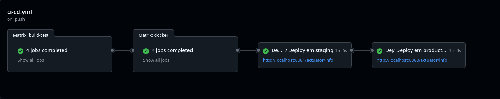
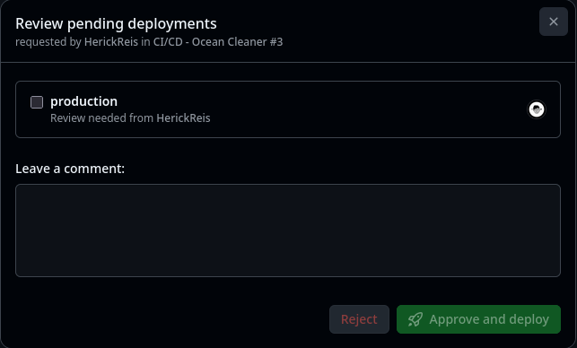
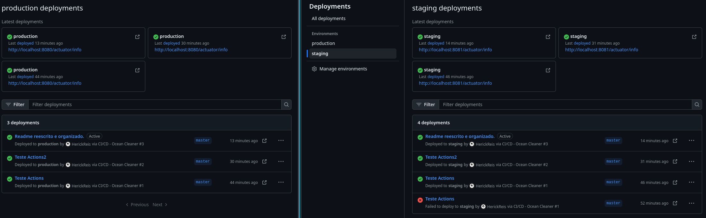
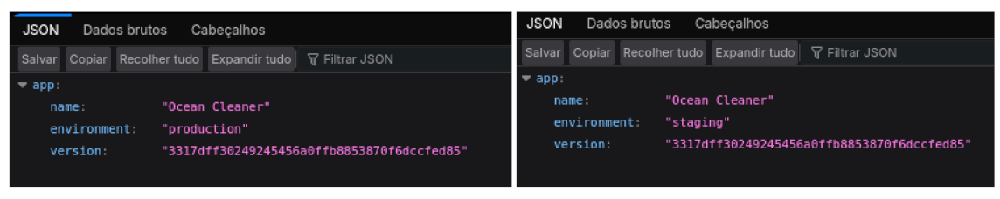
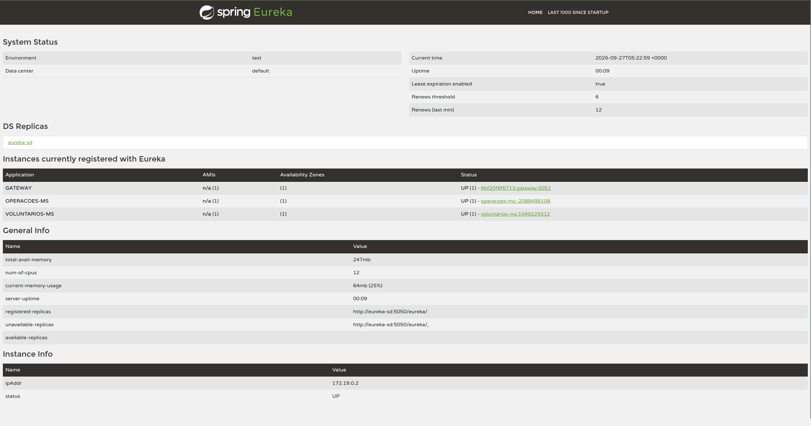

# Ocean Cleaner — Entrega DevOps (Cidades ESG Inteligentes)

Projeto ESG ambiental (ODS 14): limpeza de áreas marítimas, voluntariado, relatórios de coleta.

Integrantes:
- Gabriel Borges Cedraz de Santana (RM565911) — ga.czsan@gmail.com
- Matheus de Oliveira Radeze (RM563613) — radezemat@outlook.com
- Sabrina Pires Gomes da Silva (RM563670) — sassadesabrina@gmail.com
- Herick Reis Nascimento dos Santos (RM563259) — herickreis90.90@gmail.com

Repositório público: https://github.com/HerickReis/OceanCleaner. Compose escolhido (não Kubernetes).

Gerar PDF: `pandoc docs/ENTREGA.md -o docs/ENTREGA.pdf`

## 1. Pipeline: ferramenta, etapas, lógica

Ferramenta: GitHub Actions + GHCR + self-hosted runner Linux.

Arquivos: `.github/workflows/ci-cd.yml`, `.github/workflows/deploy.yml`, `deploy/deploy.sh`, `deploy/docker-compose.deploy.yml`.

Fluxo: push `master` -> Build/test matrix 4 svcs (`mvn verify`, JaCoCo 30%, scan Trivy HIGH,CRITICAL apenas informativo, não bloqueia) -> Docker build/push GHCR `:<sha>` + `:latest` -> Deploy staging auto (`:8081`/`:8762`) smoke `200` -> Aprovação manual -> Deploy produção (`:8080`/`:8761`).

PR roda só build/test. Imagens rastreadas por SHA em `/actuator/info` (`APP_VERSION`).

## 2. Docker: arquitetura, comandos, imagem

Arquitetura: `gateway:5051` -> `operacoes-ms`/`voluntarios-ms` (porta random via Eureka `eureka-sd:5050`) -> `oracle-db:1521`. Rede `oceancleaner-network`, volumes `oracle-data`, `oracle-backup`, env `.env`, healthcheck + `depends_on: service_healthy`.

`Dockerfile` por serviço: multi-stage `maven:3.9-eclipse-temurin-21-alpine` -> `eclipse-temurin:21-jre-alpine`, cache `pom.xml`, `USER spring`.

Comandos:
```bash
cp .env.example .env
docker compose up -d --build
docker compose ps; docker compose logs --tail=50
curl localhost:5051/actuator/info
docker compose down # -v apaga banco
```

Imagens GHCR: `oceancleaner-eureka-sd`, `oceancleaner-gateway`, `oceancleaner-operacoes-ms`, `oceancleaner-voluntarios-ms`.

## 3. Prints pipeline rodando

Ver `docs/prints/pipeline.png` (build, testes, deploy). **Atualizar os prints após o próximo deploy:** os atuais mostram o commit `3317dff`, que deixou de existir com a reescrita do histórico, e são anteriores às mudanças mais recentes.



Aprovação manual: `prints/aprovacao-producao.png`.



Histórico envs: `prints/environments.png`.



## 4. Prints staging e produção

`/actuator/info` com SHA: `prints/ambiente-info.png`.



Eureka com os 3 serviços registrados (gateway, operacoes-ms, voluntarios-ms): `prints/eureka.png`.



Testes manuais de todos os endpoints: coleção Postman/Insomnia em `docs/postman/` (ver `docs/postman/README.md`).

Smoke `deploy.sh`: `GET /operacoes-ms/operacoes` + `GET /voluntarios-ms/voluntarios` = `200` via Gateway, senão logs + rollback `.deployed_tag`.

## 5. Desafios e soluções

| Desafio | Solução |
|---|---|
| Porta random + descoberta | Eureka + `lb()` Gateway, `stripPrefix(1)` |
| Oracle slow-start | healthcheck `healthcheck.sh`, `depends_on` |
| Feign 401 | `FeignConfig` BasicAuth `API_USER/API_PASSWORD` |
| Feign 500 genérico | `GlobalExceptionHandler` Feign -> `502` |
| Relatório duplicado | idempotência: só Feign se `statusAnterior != CONCLUIDA` |
| Conclusão sem dados | fail-fast `409` exige `idVoluntario/quantidade/tipo` |
| Delete órfão | bloqueia delete operação/voluntário/área com filhos `409` |
| Email duplicado | `findByEmail` + `409` |
| `status` case | `findByStatusIgnoreCase` |
| Aprovação manual (Required reviewers) indisponível em repo privado no plano gratuito | repositório tornado público; aprovação pelo environment `production` |
| Azure for Students sem capacidade para 2 ambientes (2 Oracle + 8 JVMs) | deploy em máquina própria com self-hosted runner |
| Deploy em `ubuntu-latest` não fica acessível (VM temporária) | deploy mantido no self-hosted runner |
| Runner em caminho com espaço quebrava o bash dos jobs | runner movido para `~/actions-runner` |
| Credenciais antigas no histórico do Git (repo público) | histórico reescrito com `git filter-repo` e `push --force` |
| Sem runner | setup `~/actions-runner`, Docker e ~10 GB livres |

## 6. Checklist de entrega

- [x] Projeto compactado em .ZIP com estrutura organizada
- [x] Dockerfile funcional
- [x] docker-compose.yml ou arquivos Kubernetes (Compose escolhido)
- [x] Pipeline com etapas de build, teste e deploy
- [x] README.md com instruções e prints
- [ ] Documentação técnica com evidências (este PDF, refresh prints pós-run)
- [ ] Deploy realizado nos ambientes staging e produção (exige runner)
